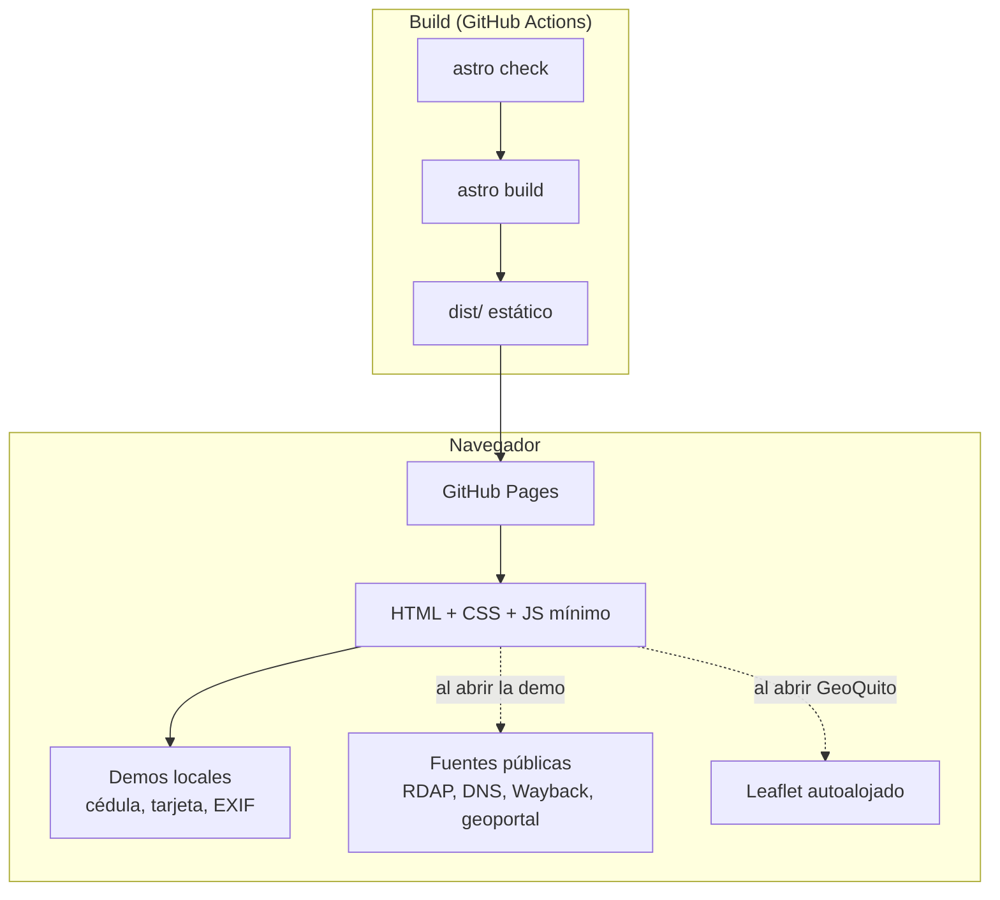

# mino-mateo.github.io

Portafolio de **Mateo Miño**, Investigador OSINT, seguridad digital y Tech Lead en [eCondor Digital](https://econdordigital.org/).

Sitio en vivo: https://mino-mateo.github.io

> [!NOTE]
> El sitio es una vitrina: cada demo es una versión **ligera** que corre en el navegador. El proyecto completo, con su documentación detallada, está en el repositorio de cada herramienta.

## Demos y sus repositorios

| Demo | Qué muestra | Datos | Repositorio completo |
|---|---|---|---|
| [Verificador de identificación](https://mino-mateo.github.io/#demo-cedula) | Cédula (EC), RUT (CL), CURP (MX) y CPF (BR) partidos por colores: lugar, tipo, secuencia y verificador | 100% local | [Verificador-de-C-dula](https://github.com/Mino-Mateo/Verificador-de-C-dula) |
| [Verificador de tarjeta](https://mino-mateo.github.io/#demo-tarjeta) | Luhn paso a paso, marca e IIN | 100% local | [Verificador-de-Tarjeta](https://github.com/Mino-Mateo/Verificador-de-Tarjeta) (29 redes de 17 países) |
| [Consulta predial GeoQuito](https://mino-mateo.github.io/#demo-geoquito) | Predio de Quito por calle o punto del mapa | API pública del geoportal municipal | Privado |
| [Ficha de un dominio](https://mino-mateo.github.io/#demo-dominio) | Registro, DNS, correo suplantable o no y primera captura, en un grafo | Fuentes públicas (RDAP, dns.google, Wayback) | [Ficha-de-Dominio](https://github.com/Mino-Mateo/Ficha-de-Dominio) |
| [Metadatos de una foto](https://mino-mateo.github.io/#demo-exif) | Qué revela una foto (GPS, cámara, fecha) y cómo limpiarla | 100% local | [Analizador-EXIF](https://github.com/Mino-Mateo/Analizador-EXIF) |

Las demos son tarjetas `<details>` nativas: se abren sin depender de JavaScript, solo una queda abierta a la vez y un enlace como `/#demo-geoquito` abre la suya.

## Arquitectura



- **Astro 7** en modo estático; `npm run build` corre `astro check` antes de compilar, así que el CI falla ante cualquier error de tipos.
- Una sola página (`src/pages/index.astro`) más la 404 propia.
- Las demos cargan lo pesado solo cuando hace falta: Leaflet (43 KB) se descarga únicamente si alguien abre GeoQuito.

## Seguridad y privacidad

| Medida | Cómo |
|---|---|
| **CSP estricta** | Nativa de Astro (`<meta http-equiv>` con hashes). `connect-src` solo permite el geoportal, dns.google, Wayback y una lista fija de servidores RDAP. Ningún `style=` en línea |
| **Sin terceros** | Sin analítica, sin cookies, sin CDN: fuentes, iconos y Leaflet se sirven desde el propio sitio |
| **Divulgación responsable** | [`/.well-known/security.txt`](https://mino-mateo.github.io/.well-known/security.txt) (RFC 9116) y reporte privado de vulnerabilidades activado en este repo |
| **Datos personales mínimos** | Solo email y ciudad. El email va ofuscado en el HTML. Sin teléfono, domicilio ni CV descargable |
| **Demos que no exponen a nadie** | La ficha de dominio nunca muestra registrantes ni contactos (el RDAP de `.ec` publica nombres). La foto de ejemplo de EXIF es sintética |

## Accesibilidad y rendimiento

- WCAG 2.2 AA: Lighthouse 100 en rendimiento, accesibilidad, buenas prácticas y SEO, en móvil y escritorio.
- `prefers-reduced-motion`, alto contraste (`forced-colors`), impresión y navegación sin JavaScript revisados.
- Controles de al menos 44 px, foco visible y resultados anunciados con `role="status"`.
- Imágenes con `astro:assets` (webp y `srcset`); la foto del hero es el LCP y no se anima.

## Correr en local

```bash
npm install
npm run dev      # http://localhost:4321
npm test         # tests de las librerías de las demos (node --test)
npm run build    # astro check + build en dist/
```

Requiere Node.js 22.18 o superior (los tests ejecutan TypeScript de forma nativa).

## Tests

- `tests/*.test.ts`: validadores de documentos (incluidas 14 CURP de referencia publicadas), anatomía de cada número, lector y limpiador EXIF, y la lógica de la ficha de dominio con respuestas RDAP grabadas y recortadas.
- `tests/fixtures/generar-jpeg.py`: regenera las fotos sintéticas con EXIF.
- Antes de cada publicación se verifica en local con Playwright (Chromium, Firefox y WebKit, 6 anchos, sin JS, movimiento reducido, alto contraste e impresión) y con Lighthouse.

## Estructura

```
src/
  pages/            index.astro y 404.astro
  layouts/          BaseLayout (metadatos, JSON-LD)
  components/       secciones del sitio
    tools/          una demo por archivo + DemoCard (tarjeta desplegable)
  lib/
    validators/     cédula, RUT, CURP, CPF, tarjeta y anatomía de cada número
    exif.ts         lector y limpiador EXIF (solo JPEG en la demo)
    dominio.ts      normalización, RDAP, DNS y evaluación del correo
  data/projects.ts  proyectos
  styles/           tokens del sistema de diseño (design.md)
public/             favicon, fuentes (JetBrains Mono, OFL), og.png, security.txt, foto de ejemplo
tests/              node --test
```

## Autor

Mateo Miño, Quito, Ecuador. [GitHub](https://github.com/Mino-Mateo) · [LinkedIn](https://www.linkedin.com/in/mateo-mi%C3%B1o/)
